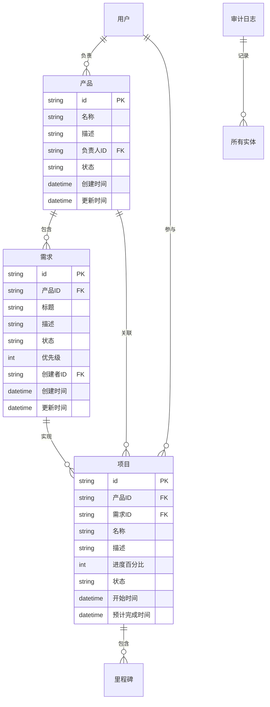

# 产品架构设计

## 系统架构概览

产品管理系统采用分层架构设计，确保系统的可扩展性、可维护性和高性能。

### 架构原则

1. **模块化设计**：各功能模块相对独立，低耦合高内聚
2. **数据驱动**：以数据流为核心，避免状态混乱
3. **接口优先**：先定义接口，再实现功能
4. **渐进式演进**：支持从单体到微服务的平滑演进

## 系统分层

### 表现层 (Presentation Layer)
- **Web前端**：响应式用户界面
- **移动端**：原生应用或PWA
- **API网关**：统一接口管理

### 业务逻辑层 (Business Logic Layer)
- **产品管理服务**：产品信息CRUD、状态管理
- **需求管理服务**：需求生命周期管理
- **项目管理服务**：进度跟踪、里程碑管理
- **分析服务**：数据分析、报表生成
- **用户权限服务**：认证授权、角色管理

### 数据访问层 (Data Access Layer)
- **数据访问对象**：统一数据访问接口
- **缓存层**：提升查询性能
- **数据同步**：确保数据一致性

### 基础设施层 (Infrastructure Layer)
- **数据库**：主数据存储
- **消息队列**：异步处理
- **文件存储**：文档、附件存储
- **监控日志**：系统监控、审计日志

## 核心实体关系



## 数据流设计

### 主要数据流

1. **产品管理流**
   ```
   用户输入 → 产品服务 → 数据验证 → 数据存储 → 审计日志
   ```

2. **需求跟踪流**
   ```
   需求创建 → 状态机处理 → 通知服务 → 数据更新 → 历史记录
   ```

3. **项目监控流**
   ```
   进度更新 → 计算引擎 → 状态同步 → 报表生成 → 可视化展示
   ```

## 技术选型原则

### 前端技术
- **响应式设计**：支持多设备访问
- **现代框架**：组件化开发
- **性能优化**：懒加载、缓存策略

### 后端技术
- **API优先**：RESTful API设计
- **服务化**：微服务架构准备
- **异步处理**：提升系统响应性

### 数据存储
- **关系型数据库**：事务一致性
- **缓存系统**：查询性能优化
- **文档存储**：非结构化数据

## 安全架构

### 认证授权
- **多因子认证**：提升安全性
- **角色权限控制**：细粒度权限管理
- **API安全**：接口访问控制

### 数据安全
- **数据加密**：敏感数据保护
- **访问审计**：操作记录追踪
- **备份恢复**：数据安全保障

## 性能优化

### 缓存策略
- **多级缓存**：内存、分布式缓存
- **缓存更新**：数据一致性保证
- **缓存穿透**：防护机制

### 数据库优化
- **索引优化**：查询性能提升
- **分库分表**：大数据量处理
- **读写分离**：并发性能优化

## 监控运维

### 系统监控
- **性能监控**：响应时间、吞吐量
- **错误监控**：异常捕获、告警
- **资源监控**：CPU、内存、网络

### 日志管理
- **结构化日志**：便于分析查询
- **日志聚合**：集中管理
- **日志分析**：问题定位、性能分析

## 部署架构

### 容器化部署
- **Docker容器**：环境一致性
- **Kubernetes编排**：自动化部署
- **服务网格**：流量管理

### 环境管理
- **多环境支持**：开发、测试、生产
- **配置管理**：环境配置分离
- **版本管理**：应用版本控制

---

**文档版本**: v1.0  
**最后更新**: 2026-03-03  
**维护者**: MK
